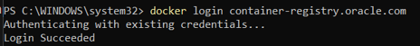
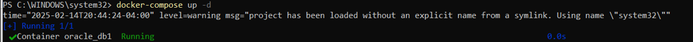
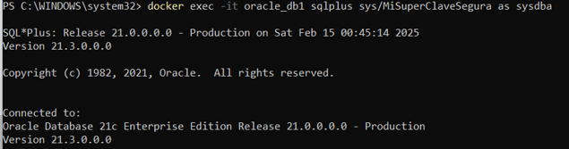
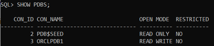
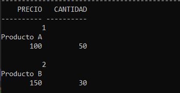

# Informe de Creación de Contenedor Oracle Database con Docker

## **Objetivo**
El objetivo de este informe es documentar el proceso para la creación y configuración de un contenedor Oracle Database utilizando Docker, incluyendo la instalación de las herramientas necesarias, la configuración de la base de datos, y la creación de usuarios y tablas dentro del contenedor.

## **Requisitos**
- Docker instalado y funcionando en el sistema.
- Cuenta de Oracle Cloud.

## **Procedimiento**

### 1️⃣ **Crear una Cuenta en Oracle Cloud**
Para poder descargar la imagen de Oracle Database desde Oracle Container Registry, es necesario tener una cuenta en Oracle Cloud.

#### **Pasos realizados:**
- Ingresé a [Oracle Container Registry](https://container-registry.oracle.com/).
- Cree una cuenta gratuita o inicié sesión si ya tenía una.
- Acepté los términos de licencia para usar Oracle Database.
- Recibí un correo de verificación y completé el proceso.

#### **Comentarios:**
- El proceso fue claro, pero hubo algunas secciones de la interfaz que no estaban completamente intuitivas. Asegurarse de buscar "enterprise" al final es crucial para acceder a las imágenes correctas de Oracle.
---

### 2️⃣ **Crear la Carpeta del Proyecto**
Creé una carpeta en el escritorio para almacenar los archivos necesarios para el proyecto .

#### **Pasos realizados:**
- Se creó la carpeta y se abrió el terminal dentro de la misma para continuar con los pasos siguientes.

#### **Comentarios:**
- Este paso fue sencillo y no presentó complicaciones.

---

### 3️⃣ **Iniciar Sesión en el Registro de Oracle desde el Terminal**
Antes de descargar la imagen de Oracle Database, se realizó el inicio de sesión en Docker.

#### **Pasos realizados:**
- Ejecuto el comando:
  ```bash
  docker login container-registry.oracle.com
Introduje mis credenciales de Oracle para iniciar sesión correctamente.
Comentarios:
El proceso fue directo, aunque es importante recordar que el nombre de usuario debe ser el de Oracle Cloud.
Imagen:

---

4️⃣ Crear un Archivo docker-compose.yml
El archivo docker-compose.yml es fundamental para levantar el contenedor de Oracle Database. Aquí definí los servicios necesarios para la base de datos.
Pasos realizados:
Usé VS Code para crear el archivo docker-compose.yml con el siguiente contenido:
yaml

services:
  oracle:
    image: container-registry.oracle.com/database/enterprise:latest
    container_name: oracle_db1
    restart: always
    ports:
      - "1521:1521"
      - "5500:5500"
    environment:
      - ORACLE_SID=ORCLCDB
      - ORACLE_PDB=ORCLPDB1
      - ORACLE_PWD=${ORACLE_PWD}
      - ORACLE_CHARACTERSET=AL32UTF8
    volumes:
      - oracle_data:/opt/oracle/oradata
    networks:
      - oracle_network

volumes:
  oracle_data:

networks:
  oracle_network:
    driver: bridge
Comentarios:
La sintaxis del archivo fue clara, pero es necesario prestar atención a los detalles de las variables de entorno y los volúmenes.

5️⃣ Crear un Archivo .env para Variables de Entorno
El archivo .env se utiliza para definir la contraseña de Oracle de manera segura.
Pasos realizados:
Creé el archivo .env en la misma carpeta del proyecto y añadí la siguiente línea:
bash

ORACLE_PWD=MiSuperClaveSegura
Comentarios:
Este paso fue sencillo, pero es importante mantener las contraseñas seguras y no compartir el archivo .env públicamente.

6️⃣ Iniciar los Contenedores
Una vez configurados los archivos, inicié los contenedores usando Docker Compose.
Pasos realizados:
Ejecuté el siguiente comando:
bash

docker-compose up -d
Para verificar que los contenedores estaban corriendo, usé:
bash

docker ps
Comentarios:
El comando docker-compose up funcionó sin problemas, y el contenedor se levantó correctamente lo unico seria tener una buena conexion a internet antes de realizarlo.
Imagen:

---

7️⃣ Acceder a la Base de Datos desde el Contenedor
Accedí a la base de datos Oracle dentro del contenedor para realizar las configuraciones adicionales.
Pasos realizados:
Ejecuté el siguiente comando para acceder a SQL*Plus:
bash

docker exec -it oracle_db1 sqlplus sys/MiSuperClaveSegura as sysdba
Comentarios:
La conexión fue exitosa sin problemas, lo que permitió continuar con la configuración.
Imagen:

---

8️⃣ Verificar las Bases de Datos Disponibles
Ejecuté el comando SHOW PDBS para ver los pluggable databases disponibles.
Pasos realizados:
Ejecuté:
sql

SHOW PDBS;
Comentarios:
La base de datos ORCLPDB1 apareció correctamente en la lista de PDBs disponibles.
Imagen:

---

9️⃣ Crear un Usuario y Tabla en la Base de Datos
Para comprobar el funcionamiento de la base de datos, creé un usuario y una tabla en el PDB.
Pasos realizados:
Creé un usuario:
sql

CREATE USER pepe IDENTIFIED BY pepe1234;
GRANT CONNECT, RESOURCE TO pepe;
ALTER USER pepe QUOTA UNLIMITED ON USERS;
Luego, creé una tabla productos:
sql
Copiar
Editar
CREATE TABLE productos (
    id_producto NUMBER PRIMARY KEY,
    nombre VARCHAR2(100),
    precio NUMBER,
    cantidad NUMBER
);
Comentarios:
Todo se realizó sin inconvenientes, y pude insertar datos correctamente en la tabla.
Imagen:

---

Conclusión
El proceso de creación del contenedor de Oracle Database con Docker fue exitoso en todos los pasos. A pesar de algunos momentos en los que la configuración de variables de entorno y la creación de archivos fue crucial, no hubo complicaciones significativas. El uso de Docker y Oracle Database resultó ser una forma eficiente y poderosa de gestionar bases de datos en un contenedor.